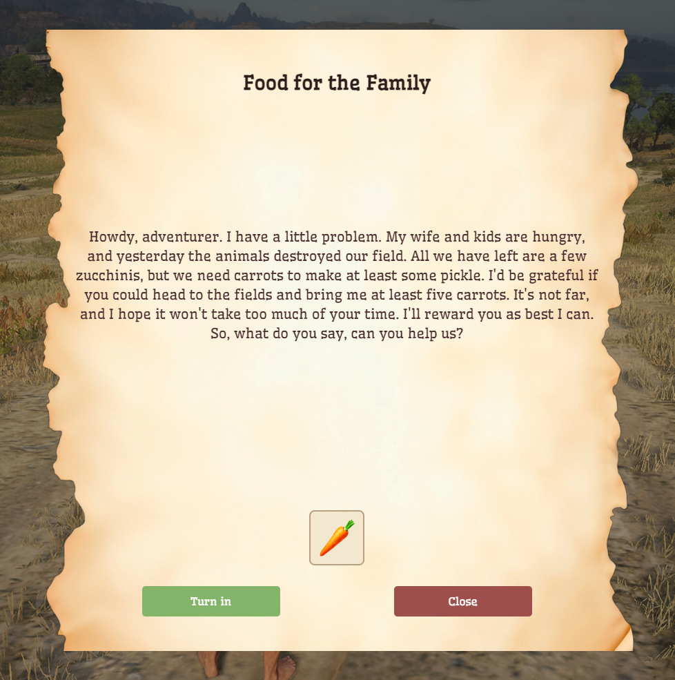

📜 Simple Item-Turn-In Quest System for RedM

This is a lightweight quest system for RedM focused on item delivery quests. Players are assigned quests where they must collect and turn in specific items.

✨ Features

Simple "turn in items" quests (no NPC following, combat, or complex conditions).

Shows required items with icons and quantities.

Automatically gives rewards and advances to the next quest upon successful turn-in.

Scrollable quest descriptions with a styled scrollbar.

Designed for easy extension via config.lua.

🧱 Dependencies

ox_lib - Used for notifications and NUI callbacks.

ox_target - Used for target.

oxmysql - Required for saving player quest progress in a MySQL-compatible database.

🗃️ Database Setup

Create the quest_progress table in your database:

CREATE TABLE `quest_progress` (
`identifier` VARCHAR(50) NOT NULL,
`quest_id` INT NOT NULL DEFAULT 1,
PRIMARY KEY (`identifier`)
);

⚙️ Configuration

Define quests in config.lua like this:

Config.Quests = {
[1] = {
title = "First Task",
description = "Bring me 3 wolf pelts.",
request = {
{
item = "wolf_pelt",
quantity = 3
}
},
reward = {
{
item = "money",
quantity = 100,
chance = 1.0
}
}
}
}

🚀 Installation

Download or clone this resource.

Add it to your server.cfg:

ensure your-resource-name

Make sure dependencies (ox_lib, oxmysql, rsg-core) are installed and started.

Configure your quests in config.lua.

📝 Notes

The system assumes item, quantity, and chance fields for both request and reward.

Item names must match your inventory item names (used for icon display and checks).

The UI is customizable in the HTML/CSS files.

📌 Summary

🔹 Simple.🔹 Focused on item collection.🔹 Easy to expand.

